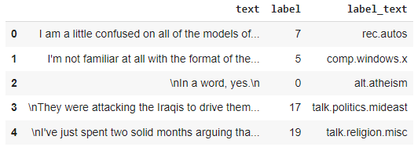
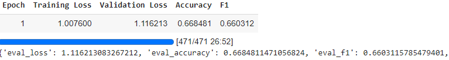

# LLM Project

I did my entire project on google collab, so i pasted the relevant code to its appropriate spots in the notebooks. Apologies if it is a bit confusing!

## Project Task

For my LLM project, i chose to go with the topic modelling route. My goal was to make a model that can find hidden structure within a given text.

## Dataset

The dataset seemed to be snippets and pieces from news sources and articles. Each piece of text had a 'label_text' column where there are a few words explaining the point of the text for that row.

## Pre-trained Model

I used the DistilBert model for this project as this model has advantages in the field of natural language processing. It is faster along with the right tweaks, and is easy to use.

## Performance Metrics

My models preformance is decent, but not considered exceptional. The model does better than random guessing, but there is room for improvement. The same can be said for generelization.

## Hyperparameters

I found that batch size was an important factor. The more the batch size the more accurate the estimate of gradient might be, but it really needs alot more memory. Something i struggled with. 

For epochs, perhaps i could have had more so the algorithm worked through the dataset more. There may have been some underfitting issues.

If i messed around more with thr weight decay, i may have been able to improve preformance by punishing large weights.# data-project-llm
